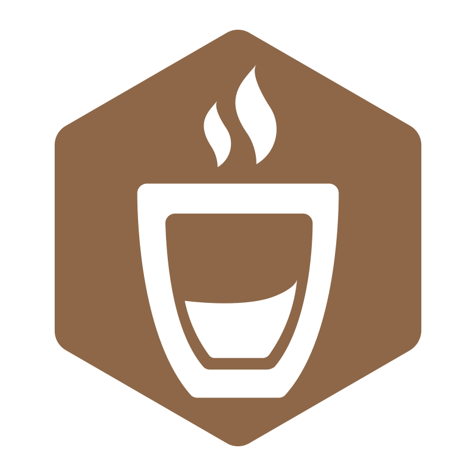
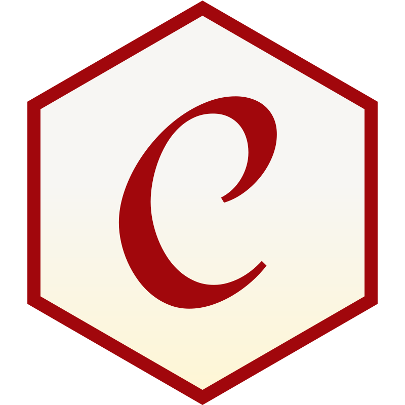
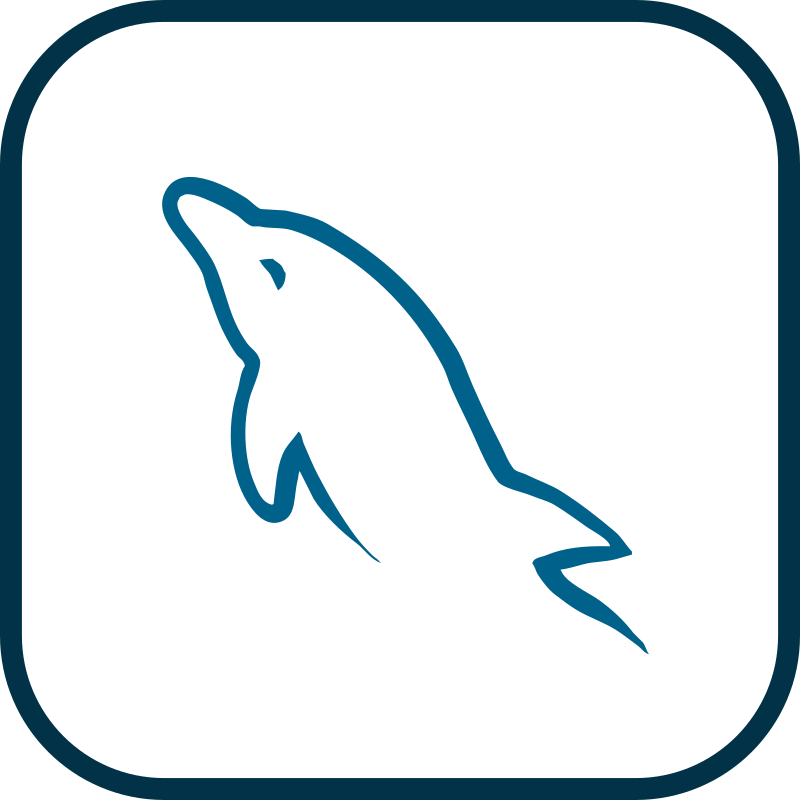

<h2 align="left">Hi, I'm Bárbara </h2>

<em>Software QA Engineer | Playwright & WebDriverIO</em>

  &nbsp;
  

I began my QA journey by performing manual testing, where I learned how important it is to truly understand the product and its users.

These days, I'm moving more into test automation 👩‍💻, keeping the same goal: helping build reliable products that bring real value to customers.

I'm very passionate about testing and enjoy collaborating with others, asking questions, and paying attention to the small details that make a big difference.

<h3>🛠️ Tools & Technologies</h3>

  &nbsp;
  &nbsp;
  &nbsp;
  &nbsp;
  &nbsp;
  &nbsp;
  &nbsp;
  &nbsp;
  &nbsp;
  &nbsp;
  &nbsp;
  &nbsp;
  &nbsp;
  &nbsp;
  &nbsp;
  &nbsp;
  &nbsp;
  

<h3>📌 Featured Projects</h3>

Here are some projects that showcase my QA approach and automation skills:

<ul>
  <li>
    🔸 <strong>
      <a href="https://github.com/barbaraalozada/playwright-cucumber">
        Playwright + Cucumber Automation Project
      </a>
    </strong> 
    
      A BDD-based test automation project built with Playwright and Cucumber using TypeScript. It follows the Page Object Model to keep tests clean and maintainable, uses structured test data management to separate data from test logic, and runs automated tests through GitHub Actions. Test results are published as Allure reports via GitHub Pages, making execution feedback easy to review and share.    
  </li>
   
  <li>
    🔸 <strong>
      <a href="https://github.com/barbaraalozada/wdio-mocha">
        WebDriverIO + Mocha Automation Project
      </a>
    </strong> 
    
      Automation framework with structured test suites using Page Object Model, data-driven testing, test structure best practices, and CI execution via GitHub Actions, with Allure test reports published to GitHub Pages. Includes detailed test documentation for each test suite, covering test steps, expected results, execution status, and automation coverage.
    
  </li>
</ul>

<h3>🌱 Currently Learning</h3>

<ul>
  <li>API testing with Playwright</li>
  <li>Visual regression testing</li>
  <li>Performance testing fundamentals</li>
  <li>Advanced CI/CD pipelines for parallel test execution</li>
</ul>

  Thanks for visiting my profile 🤍

<!--
**barbaraalozada/barbaraalozada** is a ✨ _special_ ✨ repository because its `README.md` (this file) appears on your GitHub profile.

Here are some ideas to get you started:

- 🔭 I’m currently working on ...
- 🌱 I’m currently learning ...
- 👯 I’m looking to collaborate on ...
- 🤔 I’m looking for help with ...
- 💬 Ask me about ...
- 📫 How to reach me: ...
- 😄 Pronouns: ...
- ⚡ Fun fact: ...
